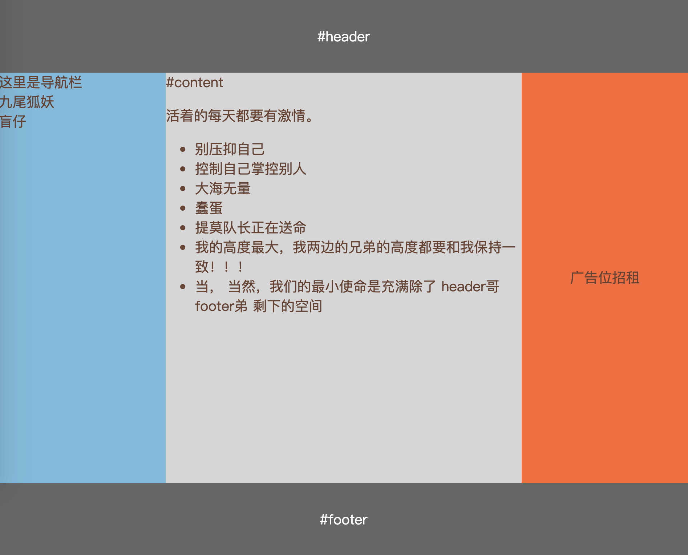

# Flex 布局实例

参考 阮一峰的 [Flex布局教程: 实例篇](http://www.ruanyifeng.com/blog/2015/07/flex-examples.html)

以及[Solved by Flexbox](https://philipwalton.github.io/solved-by-flexbox/)

## 骰子布局

[**实例代码**](./demo/dice.html)

 假设一根轴线最多只能容纳 3 个点

### 一根轴线的布局(小于等于三个点)

1 个点的布局，先考虑主轴（just-content）的布局，再考虑交叉轴（align-content）的布局

2 个点的布局，先考虑两个点在一条主轴线上的情况（相当于一个点的布局）， 再考虑不在一条主轴线上的情况，可使用 *align-self* 布局另外一个点

3 个点的布局，同两个点的情况，只是最多需要使用 2 次 *align-self*

### 多根轴线的布局(大于 三个点)

要使 3 个点之后的点自动换行，需要使用 
    
    flexwrap： wrap

简单情况： 多根轴线的布局一致，且轴线被填满。如 6 个点的两种情况，只需要设置整体的横轴和纵轴的情况就能应用到多根轴线

稍微复杂的情况： 多根轴线的布局不一致，或者轴线没被填满。轴线布局不一致需要单独设置每根轴线的布局；轴线没被填满，需要增加标签作为轴线

比如，四个点的第一种情况, 属于布局不一致，前三个点的布局是 *just-content： space-between*， 后一个点的布局是 *just-content： flex-end*；

 四个点的第二种情况， 两个点并不能填满轴线的空间， 解决办法是人为添加两个标签作为轴线，每个轴线有两个点。

 骰子布局的大概思路就是这样，学会了就掌握了*固定宽度*的布局， 需要*宽度自适应*请往下看。

## 网格布局

[**实例代码**](./demo/grid.html)

如图网格， 在网格里面添加几个元素，宽度就会等分；同一根轴线的高度一致；

### 宽度等分

宽度等分基本思路是宽度不够时自动自动缩小， 有剩余空间时宽度自动增加，使用下面的属性刚好可以达到这个目的。
    
    <!-- 缩写 -->
    flex: 1;

    <!-- 展开 -->
    flex-grow: 1;
    flex-shrink: 1;
    flex-basis: 0%;

flex 是 flex-grow, flex-shrink, flex-basis, 三个属性的缩写; 

flex-grow 为1，表示存在剩余空间是等比例放大；

flex-shrink 为1，表示剩余空间不足等比例缩小；

flex-basis 为0%， 表示自己的宽度不纳入剩余宽度计算，即设置了宽度也没用。

有关 flex 属性缩写根据什么规则展开，请看 [这个提问下的答案](https://segmentfault.com/q/1010000004080910)

### 高度一致

高度一致很简单，是因为 

    align-items: stretch

交叉轴方向默认是填满

## 输入框布局

[**实例代码**](./demo/input.html)

如图输入框左边或右边有一个提示性文字，提示性文字的宽度不变，输入框长度自适应变化

思路同网格布局，设置输入框

    flex: 1

## 圣杯布局

[**实例代码**](./demo/holy-grail.html)

[圣杯布局](https://en.wikipedia.org/wiki/Holy_grail_(web_design))大体上由三部分组成，头部，中间，底部，
头部，底部和高度度固定，中间高度根据内容自动撑开；中间又由左右中三部分构成， 左右宽度固定，中间宽度自适应。中间部分的高度
一般会撑开网页的高度。

在[Matthew Levine 的文章](https://alistapart.com/article/holygrail) 中提到了圣杯的五个要求：

    中间列宽度自适应(fluid)，两边列宽度固定
    在源文档(source)中，中间列处于侧边两列之前
    任意一列都可以作为最高列
    除了必要的元素之外，只多出一个div标签
    用简洁的CSS实现，尽量减少hack

中间列宽度自适应, 两边固定

    /* 存在剩余空间放大，空间不足不缩小，宽度自适应，高度由内容决定 */
    flex: 1 0 auto;
    /* 不放大， 不缩小， 宽度固定 12em */
    flex: 0 0 12em;

中间列处于侧边两列之前

    order: -1;

任意一列都可以作为最高列

     /* 默认值 */
    align-items: stretch;

## 固定底栏布局

[**实例代码**](./demo/sticky-footer.html)

我们常常希望底栏(#footer)保持在底部，即避免中间正文高度不够时底栏跟着上移了。

实现很简单, 给中间正文加如下属性

    flex: 1;

仔细推敲的话有个地方说不通，就是如果正文的高度超出了最大高度，却没有缩小；按理 flex-shrink 为1 剩余空间不足应该缩小；这个问题我也不懂，先解释为浏览器会始终让内容显示出来。

## 悬挂式布局

[**实例代码**](./demo/media-object.html)

左右两栏分别是图片加文字的内容，正常排列的话高的那栏会撑开高度，这样的问题是不能有效的利用空间。

那如何实现高度互不影响，按照本身的样子排列下来呢？

方法是分解，把两栏分开来看，主轴设为纵向，就可以完美解决

    

        

            

             

        

         

            

        

    

列数和内容多起来貌似是瀑布流布局

## 流式布局

[**实例代码**](./demo/flow.html)

内容在宽度不足时，换行依次排列

    display: flex;
    flex-wrap: wrap;
