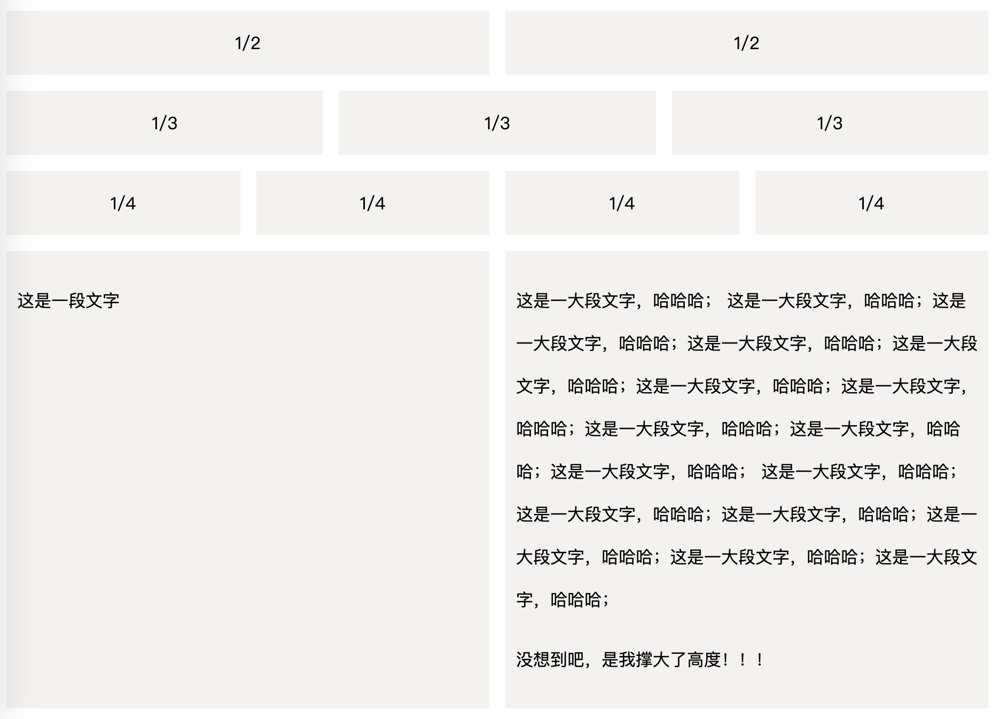
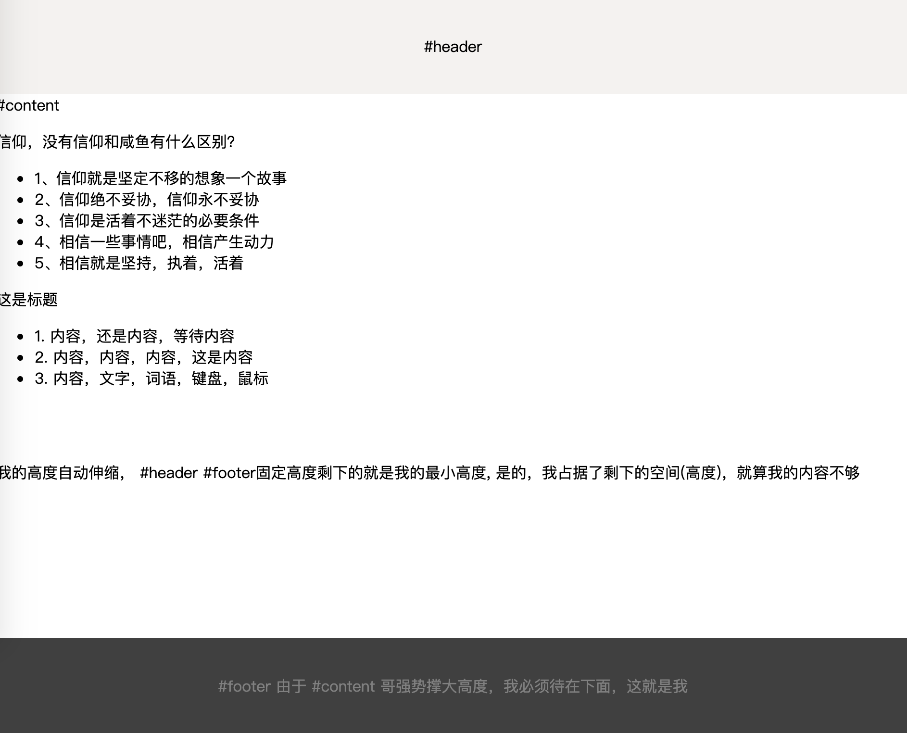

# Flex 布局实例

参考 阮一峰的 [Flex布局教程: 实例篇](http://www.ruanyifeng.com/blog/2015/07/flex-examples.html)

[骰子布局](./demo/dice.html)
     

[网格布局](./demo/grid.html)

[输入框布局](./demo/input.html)

[圣杯布局](./demo/holy-grail.html)

[悬挂式布局](./demo/media-object.html)

[固定底栏布局](./demo/sticky-footer.html)

[流式布局](./demo/flow.html)
