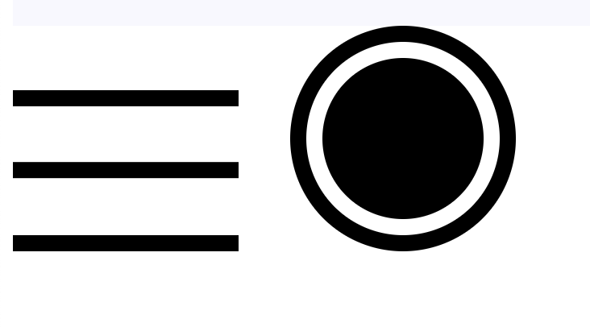

# 盒模型

盒模型包括 content，padding， border， margin

有两种盒模型，一种是 width 等于 content 的 width，一种是 width 等于 content + padding + border; 前者是浏览器的默认模型, 也叫标准盒模型，对应的样式为 box-sizing: content-box; 后者通常叫做IE盒模型需要设置 box-sizing: border-box; 关于 IE 盒模型只需要知道他是 IE 为了兼容就浏览器专门设置的一个怪异模式里面的一个盒模型。

## content

### 从替换元素说起

[替换元素](https://developer.mozilla.org/zh-CN/docs/Web/CSS/Replaced_element)的内容可以替换，比如 img标签，展示不同的图片通过对 src 属性的替换来完成。

替换元素的内容不受元素 CSS 控制，例如 iframe 里面的网页具有独立的样式。

元素的 CSS 仅能控制替换元素的大小或位置

我所理解的最常见的替换元素就是元素的内容由外部决定，比如 img 是从外部加载图片，通常浏览器发起一个请求从外部获取图片；iframe 从外部加载网页。

可以理解为浏览器要显示替换元素的内容，必须从它的属性获取内容，这个属性可以直接存储的就是内容，也可以存储的内容的地址。

### 替换元素的宽高

css 宽高 > HTML 中设置的宽高 > 元素本身宽高

指定元素宽高时，即前两种情况，元素依据 [object-fill](https://developer.mozilla.org/zh-CN/docs/Web/CSS/object-fit) 属性的设置展示。

### 替换元素的属性

#### src 属性

以 img 为例，如果去掉 src 属性，想下面这样，它就变成了普通内联元素。我称 src 属性为替换元素的替换属性，没有替换属性的元素就不是替换元素。
 
    

#### content 属性

具有 content 属性的元素被称为**匿名替换元素**

content 只是改变外观的显示，仅此而已。因此在 SEO 或者选中内容的时候是无法得到 content 的内容展示。

content 的值可以是 url 加载外部资源，也可以是字符串。

##### 字符串作为 content 值的几种形式

最简单的使用字符串作为值

    content: ''

使用 id 属性来作为 content 的值，注意 id 不能加引号

    content: attr(id);

使用 counter 作为 content 的值

    counter-reset: wang;
    content: ' ' counter(wang) ' ';

使用引号 open-quote 和 close-quote，表示引号的变量

[代码实例](./note/box/content.html)

## padding

padding 表示的是内容和 border 之间的填充区域。 padding 在块级盒子和内联盒子都有表现，只是对于内联盒子(不包括可替换元素)，它不影响布局，只出现效果。

padding 有一个值的注意的点，就是除替换元素外的内联元素 padding 在垂直方向，不会影响布局。

利用上下 padding 可以实现可控制高度的分隔符 \| ，原理是设置字体和左右 padding 为 0, 通过上下 padding 和 border做一个宽度为 0 ，高度可控的矩形。

### padding 的百分比值

padding 的百分比值是相对于宽度来计算，因此可以方便的设置宽度和高度成比例的矩形。

### padding 绘制图形

利用 padding, border, content 可以绘制图形。比如，三个横杆，上下两个是border，中间是 content，空隙是 padding。 圆环同理。

[代码实例](./note/box/padding.html)

## margin

### margin 的取值

margin 表示和相邻元素的距离，值越大距离约大。

有意思的是取负值时，距离是负的，负值意味着距离近到两者之间发生了重合。

取负值有两种情况，一种是宽度固定，负值致使偏移原来的位置；一种是宽度不固定，负值致使宽度增加。

### margin 合并

margin合并的几种情况， 相邻元素、父子元素，元素自身。

合并计算： 正正取较大者，正负相加， 负负取绝对值较大者。

marigin 合并的意义在于使元素之间的距离适当，不至于过大也不至于过小。

在父子元素发生 margin 合并时常使用使父元素成为一个块级上下文的发放来消除 margin 合并。

### margin：auto

margin: auto 的意义是 margin 的值取剩余空间的值。

因为**块级盒子**默认在水平方向占据所有空间，所以剩余空间这条符合。所以要想靠右设置"margin-left: auto;",居中设置左右 margin 为 auto。

[代码实例](./note/box/margin.html)

## border

border 是元素的边框，只能取固定值，不能取百分比

border-color: transparent; 可以增大点击面积。

border 可以画三角形。

[代码实例](./note/box/border.html)

总结：

content：替换元素的内容由外部决定，比如图片标签是浏览器从外部加载的图片数据，图片替换元素仅可以设置宽高来影响展示效果，content 属性设置的文字的字体大小可以继承，文字可以由标签的属性决定，也可用使用计数器和类似双引号之类的变量。

padding： padding 可以撑起元素的高度，与 border 和 content 联用可以绘制图形，百分比值是相对于宽度的，故可以绘制矩形

margin：第一点，不算在元素的宽高度里面，有趣的是可以取负值，正值意味着距离边缘远，负值就意味着近，当宽度固定式负值自然就意味着相反的偏移，当宽度不固定是负值也意味着偏移，只是依据流体原理，宽度是充满可用空间的，所以看上去宽度增加了。 第二点，margin 的合并同样是一个有趣的地方，合并同号取大值，异号相加就行。第三点，理解 margin: auto, auto 实际上意味着占据剩余空间。

border: border 是元素的边框，可以分别设置上下左右不同风格边框，边框可能是梯形也可能是三角形取决于是否有内容。
